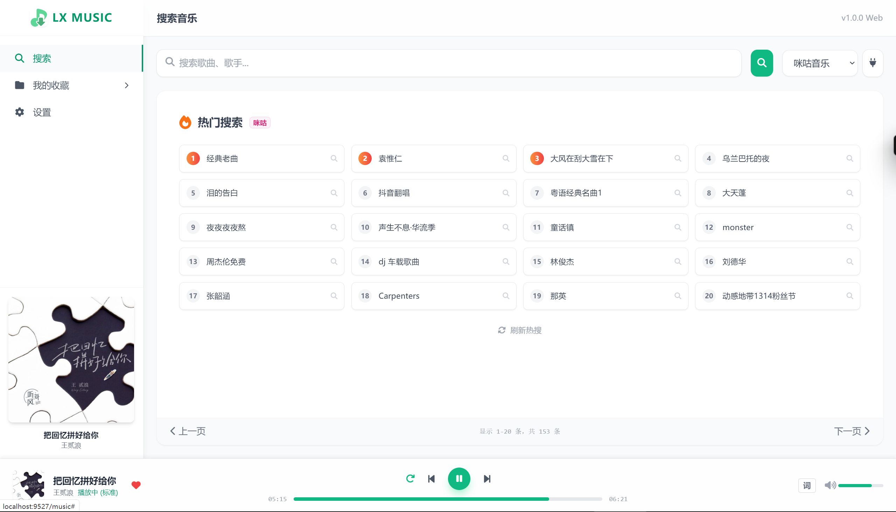
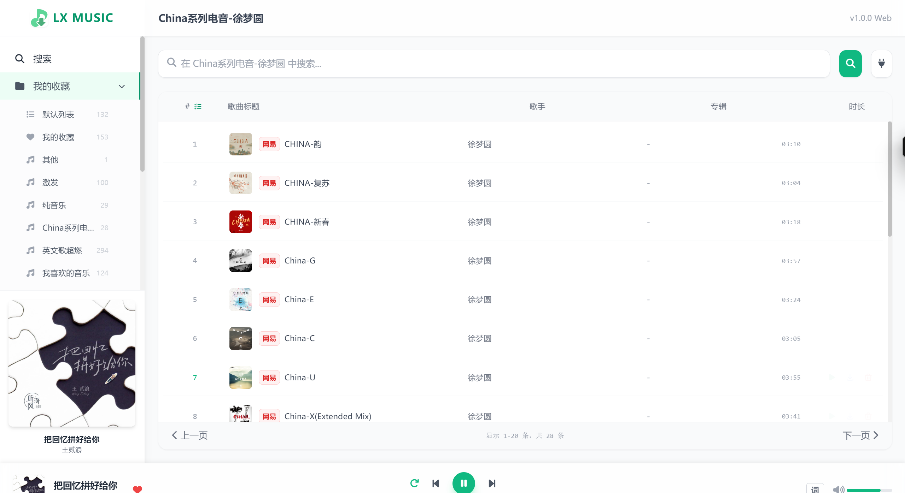
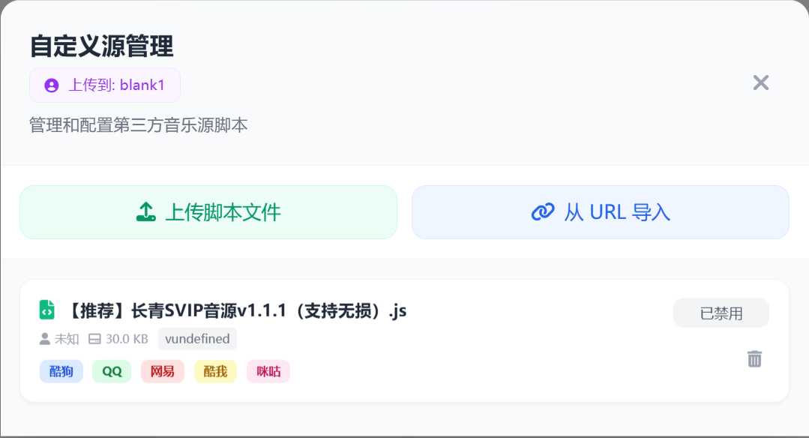
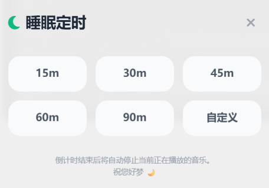
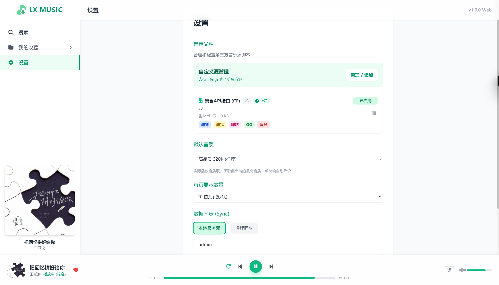

# LX Music Sync Server (Enhanced Edition)


<div align="center">
  <!--  -->
  <!-- <br>
  <h1>LX Sync Server</h1> -->
  <p>
    
    
    
    
  </p>
</div>

[同步服务器 SyncServer](md/lxserver.md) | [更新日志 Changelog](changelog.md)

本项目内置了一个功能强大的 **Web 播放器**，让你可以随时随地在浏览器中享受音乐。同时，它也是一个增强版的 [LX Music 数据同步服务端](md/lxserver.md)。

## ✨ Web 播放器核心特性

### 1. 现代化界面

采用清爽的现代化 UI 设计，支持深色模式，提供极致的视觉体验。


### 2. 多源搜索

支持聚合搜索各大音乐平台的资源，想听什么搜什么。


### 3. 歌单同步

与 LX Music 客户端数据完美互通，收藏的歌曲瞬间同步到 Web 端。



### 4. 强大的播放控制

支持播放模式切换（单曲循环、列表循环、随机播放）、音质选择、歌词显示、睡眠定时、播放倍数等功能。


### 5. 自定义源管理

支持导入自定义源脚本，扩展更多音乐来源。


### 6. 自定义显示设置

支持歌词显示，支持自定义字体与大小。


### 7.睡眠定时

支持设置播放一定时间后自动停止播放


## 🔒 访问控制与安全

为了保护你的隐私，Web 播放器支持开启访问密码。


### 开启方式

1. **环境变量配置**（推荐 Docker 用户使用）：
   - `ENABLE_WEBPLAYER_AUTH=true`: 开启认证
   - `WEBPLAYER_PASSWORD=yourpassword`: 设置访问密码
2. **Web 界面配置**：
   登录管理后台（默认端口 9527），进入 **"系统配置"**，勾选 **"启用 Web 播放器访问密码"** 并设置密码。

## 📱 移动端适配

Web 播放器针对移动端进行了深度优化，手机浏览器访问也能获得原生 App 般的体验。

---

## 🚀 快速启动

本项目基于 **Node.js** 开发，支持多种部署方式。

### 方式一：使用 Docker (推荐)

```bash
docker run -d \
  -p 9527:9527 \
  -v $(pwd)/data:/app/data \
  -v $(pwd)/logs:/app/logs \
  --name lx-sync-server \
  --restart unless-stopped \
  ghcr.io/xcq0607/lxserver:latest
```

#### 方式三：使用 Release 版本

1. 在 GitHub Releases 下载压缩包。
2. 解压后运行 `npm install --production`。
3. 执行 `npm start` 启动。

### 3. 访问说明

- **Web 播放器**: `http://your-ip:9527/music`
- **同步管理后台**: `http://your-ip:9527` (默认密码: `123456`)

---

## 🏗️ 项目架构

本项目基于 Node.js 采用前后端分离架构：

- **Backend (Express + WebSocket)**: 核心同步逻辑与 WebDAV 备份。
- **Console (Vanilla JS)**: 位于根目录，负责用户与数据管理。
- **WebPlayer (Vanilla JS)**: 位于 `/music` 目录，负责音乐播放业务。

---

## 🛠️ 配置说明

可以直接编辑 `config.js`。环境变量优先级最高：

| 环境变量                  | 对应配置项            | 说明                                               | 默认值             |
| ------------------------- | --------------------- | -------------------------------------------------- | ------------------ |
| `PORT`                  | `port`              | 服务端口                                           | `9527`           |
| `BIND_IP`               | `bindIP`            | 绑定 IP                                            | `0.0.0.0`        |
| `FRONTEND_PASSWORD`     | `frontend.password` | Web 管理界面访问密码                               | `123456`         |
| `SERVER_NAME`           | `serverName`        | 同步服务名称                                       | `My Sync Server` |
| `MAX_SNAPSHOT_NUM`      | `maxSnapshotNum`    | 保留的最大快照数量                                 | `10`             |
| `PROXY_HEADER`          | `proxy.header`      | 代理转发 IP 头 (如 `x-real-ip`)                  | -                  |
| `WEBDAV_URL`            | `webdav.url`        | WebDAV 地址                                        | -                  |
| `WEBDAV_USERNAME`       | `webdav.username`   | WebDAV 用户名                                      | -                  |
| `WEBDAV_PASSWORD`       | `webdav.password`   | WebDAV 密码                                        | -                  |
| `SYNC_INTERVAL`         | `sync.interval`     | WebDAV 自动备份间隔(分钟)                          | `60`             |
| `ENABLE_WEBPLAYER_AUTH` | `player.enableAuth` | 是否启用 Web 播放器访问密码                        | `false`          |
| `ENABLE_WEBPLAYER_AUTH` | `player.enableAuth` | 是否启用 Web 播放器访问密码                        | `false`          |
| `WEBPLAYER_PASSWORD`    | `player.password`   | Web 播放器访问密码                                 | 123456             |
| `DISABLE_TELEMETRY`     | `disableTelemetry`  | 是否禁用匿名数据统计，系统更新提示以及系统公告提示 | `false`          |

---

## 🛡️ 数据收集与隐私说明

本项目集成了 PostHog 匿名数据统计，主要用于：

1. **Bug 追踪**: 收集版本号、环境类型。
2. **通知推送**: 弹出 **版本更新提醒** 与 **紧急维护公告**。

- **绝对匿名**: 绝不收集 IP、用户名或具体歌单内容。
- **关闭方法**: 环境变量设置 `DISABLE_TELEMETRY=true`。**注意：关闭后将无法收到新版本通知。**

---

## 🤝 贡献与致谢

- 修改自 [lyswhut/lx-music-sync-server](https://github.com/lyswhut/lx-music-sync-server)。
- Web 播放器逻辑参考 [lx-music-desktop](https://github.com/lyswhut/lx-music-desktop)。
- 接口实现基于 `musicsdk`。

## 📄 开源协议

Apache License 2.0 copyright (c) 2026 [xcq0607](https://github.com/xcq0607)

## 📈 Star History

<a href="https://star-history.com/#XCQ0607/lxserver&Date">
  <picture>
    <source media="(prefers-color-scheme: dark)" srcset="https://api.star-history.com/svg?repos=XCQ0607/lxserver&type=Date&theme=dark" />
    <source media="(prefers-color-scheme: light)" srcset="https://api.star-history.com/svg?repos=XCQ0607/lxserver&type=Date" />
    
  </picture>
</a>
