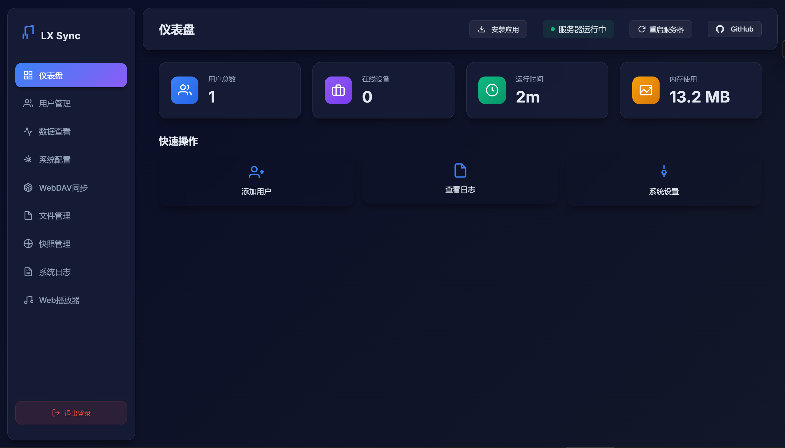
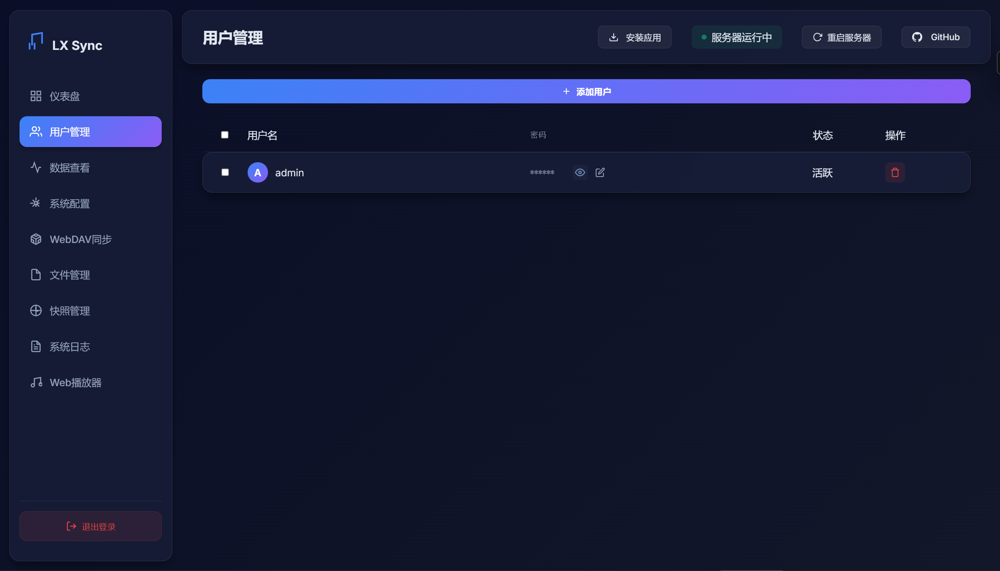
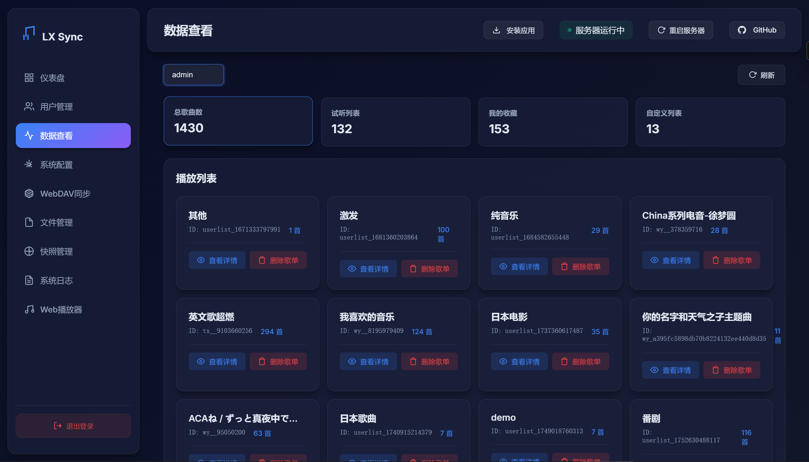
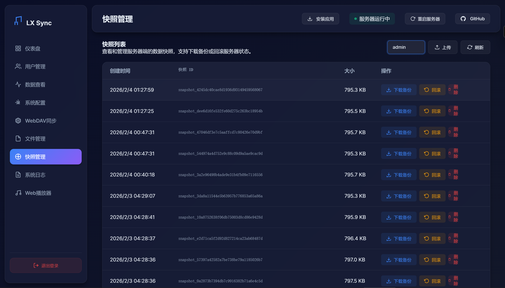
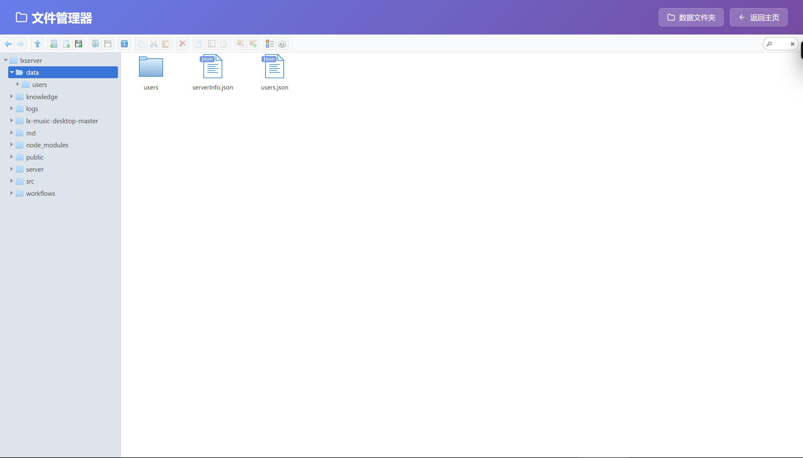
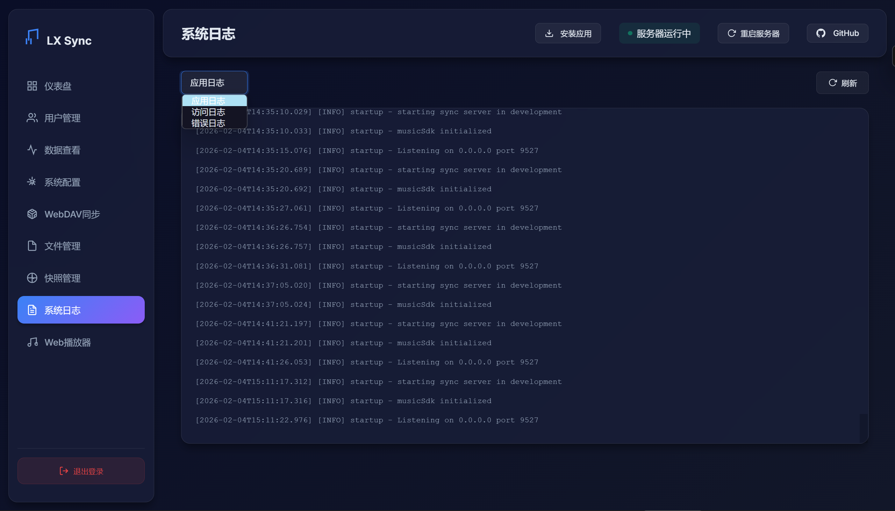
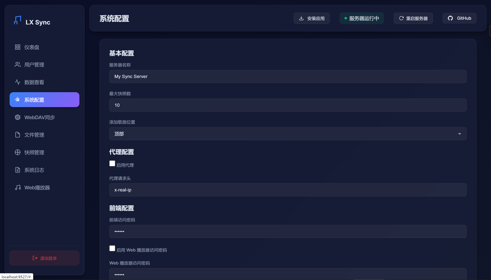
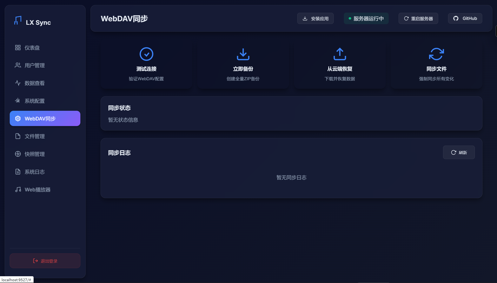

# LX Music Sync Server (Enhanced Edition)

<div align="center">
  
  <br>
  <h1>LX Sync Server</h1>
  <p>
    
    
    
    
  </p>
</div>

[网页播放器 WebPlayer](md/WEBPLAYER.md) | [更新日志 Changelog](changelog.md)

基于 [lyswhut/lx-music-sync-server](https://github.com/lyswhut/lx-music-sync-server) 开发的增强版 LX Music 数据同步服务端。

本项目在原版基础上增加了强大的 **Web 管理界面**，支持用户管理、数据查看、快照回滚、WebDAV 备份等高级功能，让私有化部署更加便捷易用。

## ✨ 主要特性

### 📊 仪表盘

直观的 Web 界面，无需敲命令即可管理服务状态。



### 👥 用户管理

支持通过界面添加、删除用户，修改密码，轻松管理多用户权限。



### 🎵 数据查看与管理

- 在线查看所有用户的歌单和歌曲详情。
- 支持按歌单、歌曲名搜索和排序。
- 支持批量删除歌曲、删除歌单。




### 💾 快照管理 (Snapshot)

- **查看快照**：浏览服务器自动生成的历史数据快照。
- **下载备份**：将快照下载为 `lx_backup.json`，可直接导入 LX Music 客户端。
- **一键回滚**：支持将服务器数据回滚到任意历史时刻（救命功能！）。



### 📂 文件与日志管理

内置简易文件管理器，方便在线查看、下载和管理服务器上的日志和配置文件。




### ⚙️ 系统配置

支持通过 Web 界面修改系统配置（端口、代理、密码等），无需手动编辑 `config.js` 文件。



### ☁️ WebDAV 同步备份

- 支持将服务器数据自动/手动备份到 WebDAV 网盘（如坚果云、Nextcloud、Alist 等）。
- 支持从 WebDAV 云端恢复数据，确保数据安全。



### 🎧 Web 播放器

**[Web 播放器](md/WEBPLAYER.md)**：内置功能强大的 Web 端音乐播放器，支持多源搜索、歌单同步、歌词显示等，随时随地享受音乐。

## 🚀 快速开始

### 1. 环境要求

- Node.js 16+

### 2. 安装与启动

#### 方式一：直接运行

```bash
# 1. 克隆项目
git clone https://github.com/XCQ0607/lxserver.git
cd lxserver

# 2. 安装依赖
npm ci

# 3. 编译项目
npm run build

# 4. 启动服务
npm start
```

#### 方式二：使用 Docker (推荐)

直接使用官方构建的镜像（支持 amd64/arm64）：

```bash
docker run -d \
  -p 9527:9527 \
  -v $(pwd)/data:/app/data \
  -v $(pwd)/logs:/app/logs \
  --name lx-sync-server \
  --restart unless-stopped \
  ghcr.io/xcq0607/lxserver:latest
```

也可以指定特定版本：`ghcr.io/xcq0607/lxserver:v1.0.0`

#### 方式三：使用 Release 版本 (手动部署)

1. 在 GitHub Releases 页面下载最新的 `lx-music-sync-server-vX.X.X.zip`压缩包。
2. 解压到服务器目录。
3. 进入目录并安装依赖（仅生产环境依赖）：
   ```bash
   npm install --production
   ```
4. 启动服务：
   ```bash
   npm start
   ```

### 3. 访问管理界面

服务启动后，打开浏览器访问：

http://localhost:9527

- **默认端口**：`9527` (可在 `config.js` 中修改)
- **默认管理密码**：`123456`

> ⚠️ **注意**：首次登录后，请务必在“系统配置”中修改前端访问密码！

## 🏗️ 项目架构

本项目采用 **前后端分离** 但 **同构部署** 的架构：

- **服务端 (Backend)**: 基于 Node.js (Express + WebSocket)，负责核心的数据同步、WebDAV 交互、API 接口提供以及静态资源服务。源码位于 `src/`，编译后运行于 `server/`。
- **管理前端 (Console)**: 基于原生 HTML/CSS/JS 开发的单页应用 (SPA)，位于 `public/` 根目录。通过 AJAX 与后端 API 交互。
- **Web 播放器 (Player)**: 集成在 `public/music/` 目录下的独立 SPA，复用了 [lx-music-desktop](https://github.com/lyswhut/lx-music-desktop) 的核心逻辑。

所有前端资源均由 Node.js 服务端直接托管，无需额外部署 Nginx（虽然推荐使用 Nginx 做反向代理以获得 HTTPS 支持）。

## 🛠️ 配置说明

虽然可以通过 Web 界面修改大部分配置，但你也可以手动编辑根目录下的 `config.js` 文件。

### 环境变量

支持使用环境变量覆盖 `config.js` 中的配置（Docker 部署时非常有用）：

| 环境变量                  | 对应配置项            | 说明                              | 默认值             |
| ------------------------- | --------------------- | --------------------------------- | ------------------ |
| `PORT`                  | `port`              | 服务端口                          | `9527`           |
| `BIND_IP`               | `bindIP`            | 绑定 IP                           | `0.0.0.0`        |
| `FRONTEND_PASSWORD`     | `frontend.password` | Web 管理界面访问密码              | `123456`         |
| `SERVER_NAME`           | `serverName`        | 同步服务名称                      | `My Sync Server` |
| `MAX_SNAPSHOT_NUM`      | `maxSnapshotNum`    | 保留的最大快照数量                | `10`             |
| `PROXY_HEADER`          | `proxy.header`      | 代理转发 IP 头 (如 `x-real-ip`) | -                  |
| `WEBDAV_URL`            | `webdav.url`        | WebDAV 地址                       | -                  |
| `WEBDAV_USERNAME`       | `webdav.username`   | WebDAV 用户名                     | -                  |
| `WEBDAV_PASSWORD`       | `webdav.password`   | WebDAV 密码                       | -                  |
| `SYNC_INTERVAL`         | `sync.interval`     | WebDAV 自动备份间隔(分钟)         | `60`             |
| `ENABLE_WEBPLAYER_AUTH` | `player.enableAuth` | 是否启用 Web 播放器访问密码       | `false`          |
| `WEBPLAYER_PASSWORD`    | `player.password`   | Web 播放器访问密码                | 123456             |

### 用户配置

可以通过环境变量预设同步用户：

格式：`LX_USER_<用户名>=<密码>`

示例：

```bash
export LX_USER_admin=123456
export LX_USER_guest=guest123
```

## 📖 功能指南

### 快照回滚与备份

在 **“快照管理”** 页面，你可以看到服务器自动保存的数据快照。

- **下载备份**：点击“下载备份”按钮，会生成一个标准的 LX Music 备份文件 (`.json`)。你可以直接在 LX Music 客户端（PC/移动端）的“设置 -> 数据备份与恢复 -> 导入数据”中导入此文件。
- **回滚 (Restore)**：点击“回滚”按钮，服务器将重置为该快照的状态。
  - **注意**：回滚后，所有连接的客户端在下次同步时，必须选择 **“远程覆盖本地”**，否则可能会导致数据再次被客户端覆盖。

### WebDAV 云备份

在 **“WebDAV 同步”** 页面配置好 WebDAV 信息后：

- **立即备份**：手动触发一次全量备份打包上传。
- **从云端恢复**：将云端的备份文件下载并覆盖本地数据（慎用）。
- **自动备份**：系统会根据配置的间隔时间（默认 60 分钟）自动检测数据变化并备份。

### Nginx 反向代理配置

如果你将服务部署在公网，建议使用 Nginx 配置 HTTPS。

```nginx
server {
    listen 80;
    server_name your.domain.com;

    location / {
        proxy_pass http://127.0.0.1:9999;
        proxy_http_version 1.1;
        proxy_set_header Upgrade $http_upgrade;
        proxy_set_header Connection "upgrade";
        proxy_set_header Host $host;
        proxy_set_header X-Real-IP $remote_addr;
        proxy_set_header X-Forwarded-For $proxy_add_x_forwarded_for;
    }
}
```

## 🤝 贡献与致谢

本项目修改自 [lyswhut/lx-music-sync-server](https://github.com/lyswhut/lx-music-sync-server)，WEB页端LX的实现参考[ lx-music-desktop](https://github.com/lyswhut/lx-music-desktop) ，感谢 lyswhut，接口实现通过 [lx-music-desktop](https://github.com/lyswhut/lx-music-desktop) 项目的 musicsdk 实现。

如果你发现任何 Bug 或有新的功能建议，欢迎提交 Issue 或 Pull Request。

## 📄 开源协议

Apache License 2.0
