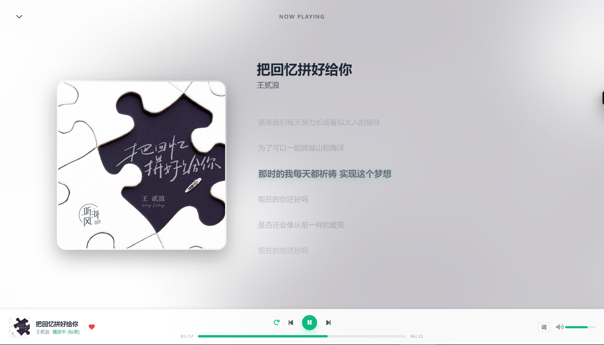

# 【分享】自建LX Music同步服务增强版：带Web管理后台+网页版播放器，一键部署！

各位佬友大家好！👋

大家平常听歌用洛雪音乐（LX Music）吗？是不是苦于官方同步服务搭建起来只有枯燥的命令行，或者想在没有客户端的设备上也想听听歌单里的歌？

今天给佬友们分享一个我基于 [lyswhut/lx-music-sync-server](https://github.com/lyswhut/lx-music-sync-server) 搓出来的**增强版同步服务端**！🎵

项目地址：[https://github.com/XCQ0607/lxserver](https://github.com/XCQ0607/lxserver)

## 🤔 这是个啥？

简单来说，这是一个**二合一**的快乐方案：
1.  **数据同步服务端**：完美支持 LX Music 客户端的同步功能。
2.  **Web 管理面板**：可视化管理用户、数据、日志，还能快照回滚！
3.  **Web 播放器**：内置了一个网页版的 LX Music（参考了桌面版实现），随时随地在浏览器听歌。

全部功能打包在一个 Docker 镜像里，一键部署，开箱即用！🚀

## ✨ 核心亮点

### 1. 📊 可视化仪表盘 & 用户管理
告别黑框框，服务状态一目了然。支持直接在网页上添加/删除用户，管理多人使用非常方便。


### 2. 💾 救命的快照回滚
手滑把歌单删了？客户端同步出问题了？
别慌！后台自动生成快照，支持**一键回滚**到历史状态，不仅能回滚，还能把快照下载下来导入回客户端。


### 3. ☁️ WebDAV 云备份
支持把你的珍贵歌单数据自动备份到 WebDAV 网盘（坚果云、Alist、Nextcloud 等），双重保险！


### 4. 🎧 内置 Web 播放器
这个是我最喜欢的功能！参考了官方桌面版的设计，用浏览器就能听歌。
- **多源搜索**：想听啥搜啥。
- **歌单同步**：登录后自动同步你收藏的歌单。
- **PWA 支持**：手机安上就是个独立 App。


*(注：Web播放器截图路径可能需要根据实际情况调整，这里假设是 player.png，如果没有可以用文字代替)*

## 🚀 如何食用？

最推荐 **Docker** 一键部署，支持 amd64 和 arm64：

```bash
docker run -d \
  -p 9527:9527 \
  -v $(pwd)/data:/app/data \
  --name lx-sync-server \
  --restart unless-stopped \
  ghcr.io/xcq0607/lxserver:latest
```

部署好后访问 `http://IP:9527` 即可。

## 🤝 致谢

本项目在巨人的肩膀上完成：
- 核心同步逻辑基于 [lyswhut/lx-music-sync-server](https://github.com/lyswhut/lx-music-sync-server)
- Web 播放器实现参考及接口支持来自 [lyswhut/lx-music-desktop](https://github.com/lyswhut/lx-music-desktop)

感谢 lyswhut 大佬开发了这么好用的工具！

---

**各位佬友如果觉得这个项目不错，求去 GitHub 点个 Star ⭐，或者给帖子点点赞 👍，感谢大家支持！**

如果有 Bug 或者建议，欢迎在评论区或者 Issue 提出来~
